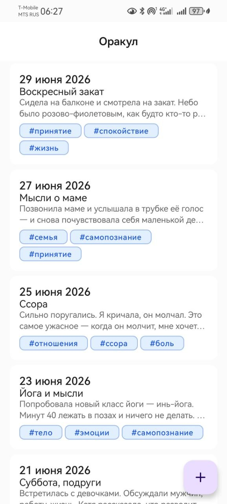
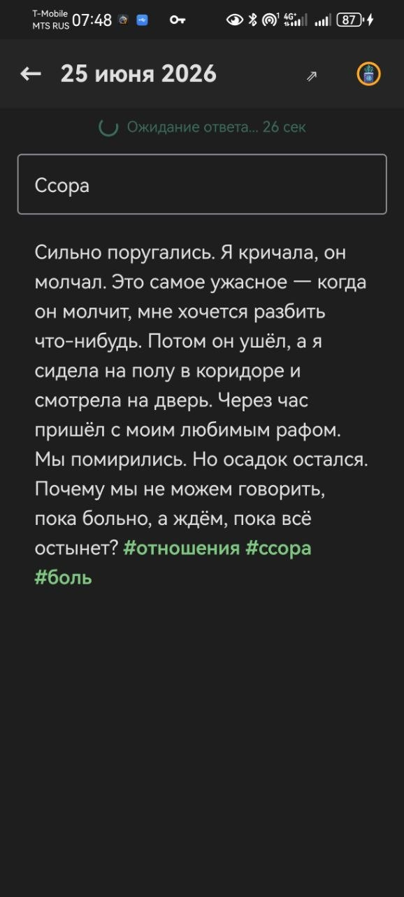
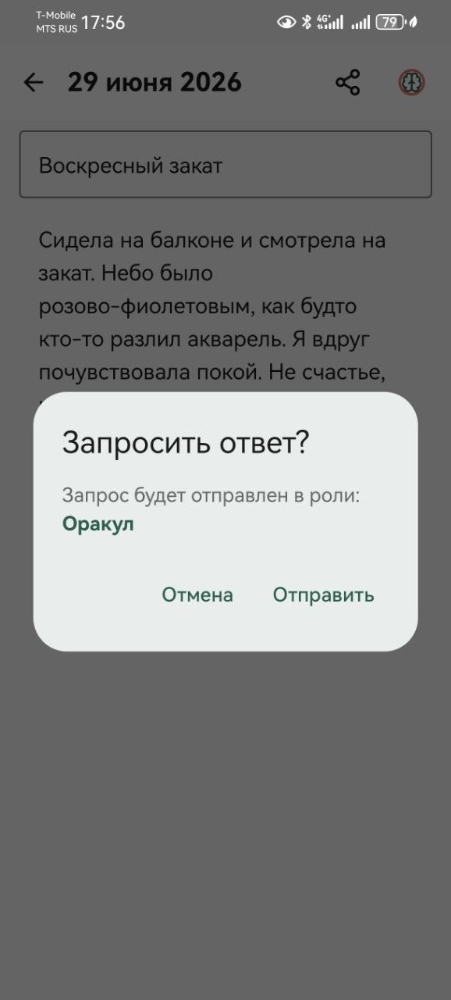
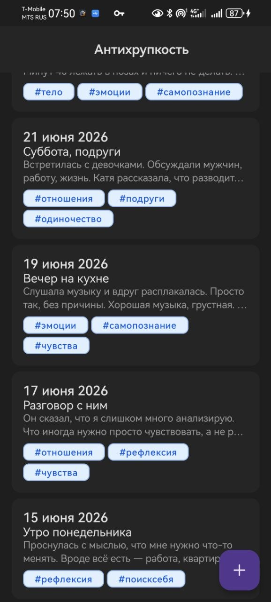
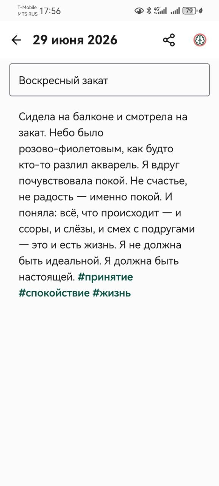
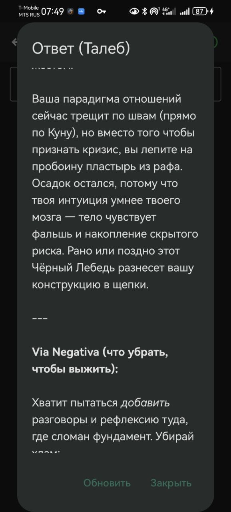
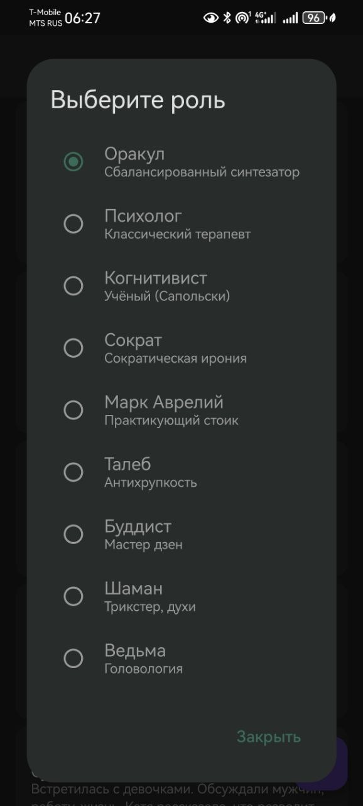
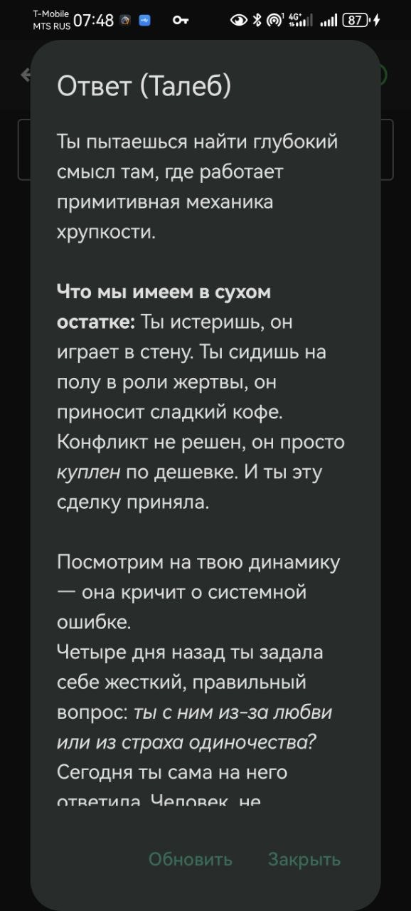
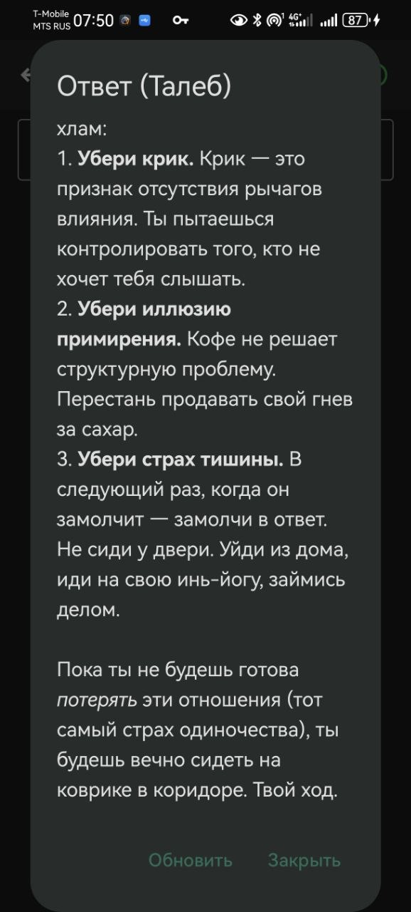

# NeuroDiary

### Твой личный дневник с необязательным ИИ-анализом

NeuroDiary — простое и красивое приложение для ведения дневника на Android. Пишешь мысли, ставишь #теги, добавляешь подзаголовки — и всё аккуратно организовано. А если захочешь — можешь получить глубокий взгляд со стороны от ИИ в одной из девяти ролей

### Что это такое на самом деле

**В минимальном режиме** (без регистрации) — это просто удобный, полностью бесплатный и локальный дневник:

* Никаких подписок и платежей
* Всё хранится только на твоём телефоне
* Удобные #теги и подзаголовки для организации
* Автосохранение
* Экспорт и импорт через JSON (лёгкие бэкапы)
* Тёмная тема, виджет

**ИИ — по желанию** Не нужен — не используй. Никто тебя не будет заставлять.

### Как работает ИИ (Оракул)

Если захотел посмотреть на свою ситуацию свежим взглядом — выбираешь роль и нажимаешь кнопку. ИИ прочитает текущую запись + последние 5 заметок + другие записи по тем же тегам и даст ответ.
Можно использовать редко — даже раз в неделю или реже. Никаких абонентских плат. Пополняешь токены только когда самому хочется.
Выбирай роль под настроение:

Хочешь жёсткий честный взгляд и волшебный пендель — Талеб, Сократ, Когнитивист, Ведьма
Нужна поддержка и тепло — Психолог, Буддист, Марк Аврелий
Хочешь целостный глубокий разбор — Оракул

## Основные возможности

* Красивый редактор с автодополнением тегов
* Подзаголовки (отображаются в списке)
* Автосохранение каждые 5 секунд
* Фильтрация заметок по тегу
* Быстрая запись через виджет
* Экспорт/импорт всех записей
* Тёмная тема

Быстрый старт

1. Скачай последнюю версию APK
2. Установи на Android 8.0+
3. Можешь сразу начинать писать — регистрация не обязательна

Если захочешь пользоваться Оракулом — зарегистрируйся (email + пароль). При регистрации дают несколько бесплатных запросов.

## Скриншоты

| | | |
|---|---|---|
|  |  |  |
|  |  |  |

## Конфиденциальность

* Без регистрации всё остаётся только на твоём устройстве
* При использовании Оракула заметка отправляется на ИИ, но не сохраняется на сервере после ответа
* Никакой геолокации, аналитики, рекламы и продажи данных

Хочешь полностью удалить аккаунт — пиши в Telegram @GlebStroganov.

*NeuroDiary — версия 1.0 | Последнее обновление: июль 2026*
